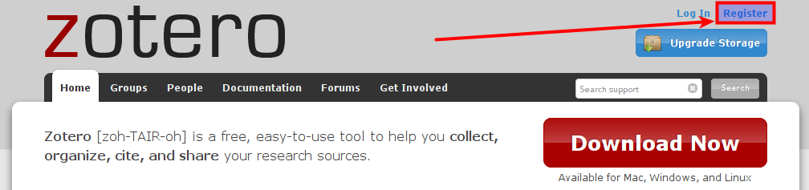

# Un compte Zotero

Il est techniquement possible d'utiliser Zotero sans se créer de compte sur [zotero.org](https://www.zotero.org). Pourtant, disposer d'un compte Zotero rend possibles des fonctionnalités dont il serait très dommage de ne pas profiter. De plus, ce compte est gratuit, sa politique à l'égard des données personnelles est [clairement publiée](https://www.zotero.org/support/terms/privacy), et il est tout à fait possible de supprimer son compte et d'exporter ses données pour les utiliser avec un autre logiciel. La réciproque n'est pas toujours vraie.

Avec un compte Zotero, il est possible de :

* synchroniser ses collections de références bibliographiques entre plusieurs ordinateurs (laptop personnel, poste informatique institutionnel),
* accéder à ses collections sur zotero.org,
* rendre publique ses collections,
* créer des groupes pour rassembler des références bibliographiques pour un travail ou un projet particulier.

Pour la création de son compte, il faut se rendre sur le site [zotero.org](https://www.zotero.org). En haut à droite de la page d'accueil se trouve le lien *Register*.

Il s'agit ensuite de renseigner les informations habituelles :

* un nom d'utilisateur,
* un email valide,
* un mot de passe (si possible pas trop faible).

Il ne reste plus qu'à passer le *captcha* afin de prouver que vous n'êtes pas un robot, et c'est tout.
