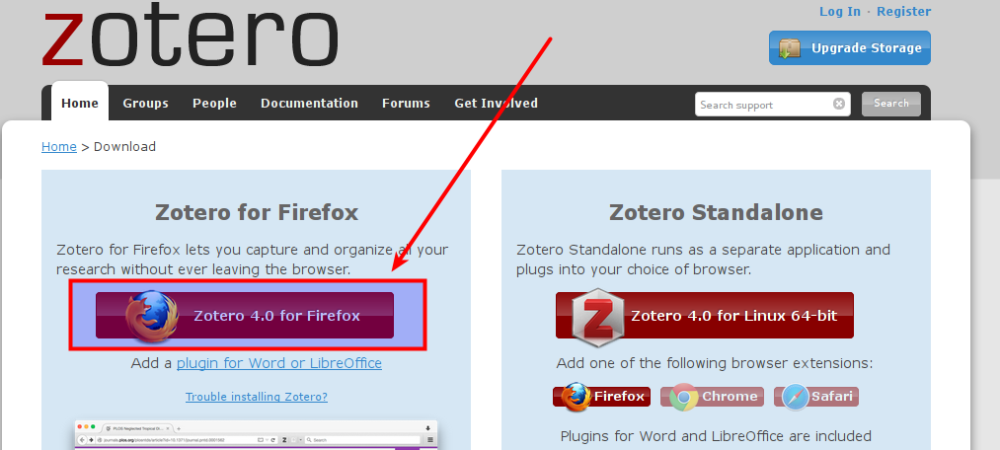
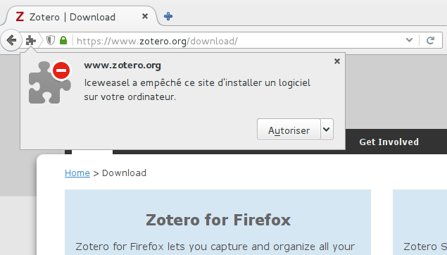
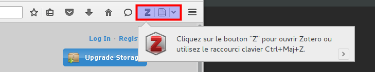
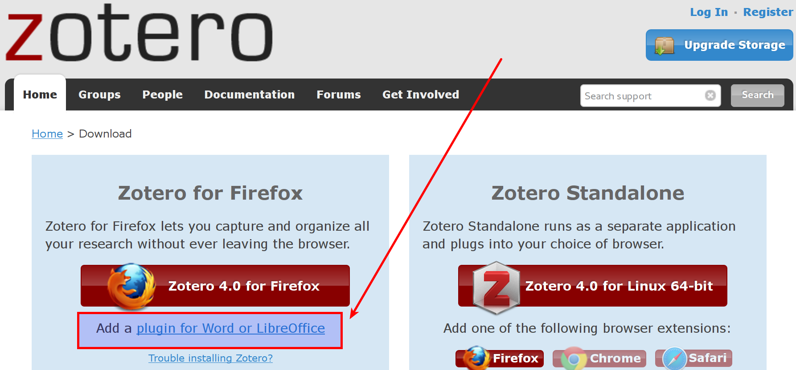
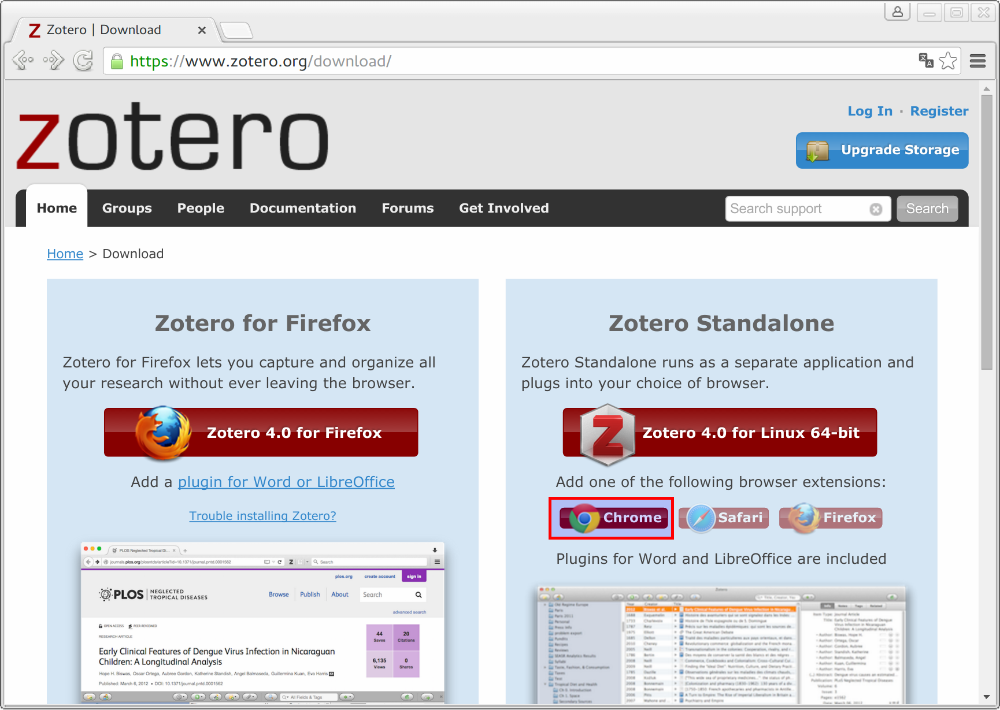
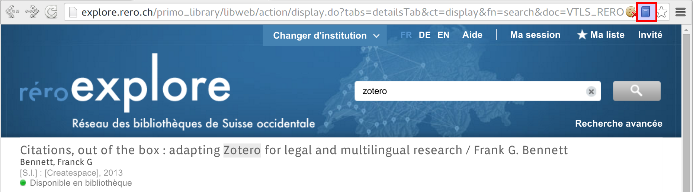

# Installer Zotero

Pour installer Zotero, deux méthodes existent :

1. l'extension pour Firefox,
2. *Zotero Standalone*.

Il s'agit dans les deux cas du même logiciel, avec exactement la même interface et les mêmes fonctionnalités. Le plus simple est de choisir l'extension pour Firefox et ainsi de profiter d'utiliser un excellent navigateur Web *libre* et soucieux de la vie privée de ses utilisateurs.

Si vous ne voulez pas travailler avec Firefox, la version *Standalone* vous permet de chercher des références bibliographiques en ligne avec *Safari* ou *Google Chrome* en installant une extension pour votre navigateur préféré.

Sur leur site [*Mastering Zotero*](http://zotero-manual.github.io/zotero-manual/), Sebastian Karcher et Rintze M. Zelle proposent un tableau synthétisant les différences entre les deux solutions : 

## L'extension pour Firefox

Rendez-vous sur la page de téléchargement de Zotero, soit en passant par le bouton *Download* de la page d'accueil du site, soit en utilisant directement l'URL suivante : https://www.zotero.org/download

Lorsque vous cliquez sur le bouton *Zotero for Firefox*, votre navigateur Web vous demande l'autorisation de le télécharger.

Le téléchargement s'effectue et un message apparaît vous demandant de lancer l'installation, puis de redémarrer votre navigateur. Une fois le navigateur redémarré, de nouveaux boutons sont apparus à droite du champ de recherche et un bref message d'explication apparaît.

Zotero est installé.

### Les plugins pour traitements de texte

Zotero peut être intégrer à un traitement de texte, dans le but de faciliter l'insertion de citation et la génération de la bibliographie à partir de celles-ci. Les logiciels supportés sont :

1. Les suites bureautiques libres les plus connues à commencer par [LibreOffice](http://www.libreoffice.org/), [Apache OpenOffice](http://www.openoffice.org/). OpenOffice.org est également supporté, mais ce logiciel est abandonné depuis 2010.
2. Le traitement de texte de la suite bureautique Microsoft Office, à savoir Microsoft Word, dans sa version pour Microsoft Windows et pour OS X.

Pour installer ces plugins, il est nécessaire de se rendre encore une fois sur le [site de Zotero](https://www.zotero.org), puis sur la page des [*download*](https://www.zotero.org/download). Sous le bouton pour l'installation de l'extension pour Firefox se trouve le lien vers la page des plugins pour les traitements de texte.

La version *Standalone* inclut ces plugins, aussi n'est-il pas nécessaire de les installer si l'on a choisi cette version.

## *Zotero Standalone*

L'installation de la version *Standalone* n'est pas plus complexe. Il faut commencer par choisir le bouton de droite sur la page de téléchargement. Normalement le site a identifié le système d'exploitation qui vous concerne et vous propose la version du logiciel la plus adaptée. Une fois que vous avez cliqué sur ce bouton, la procédure qui suit est celle que vous avez l'habitude pour installer un logiciel sur votre ordinateur.

Pour *Windows* vous téléchargez un fichier ``.exe``, que vous devez ensuite exécuter. Sous *OS X*, il s'agit d'un ``.dmg`` qu'il faut glisser-déposer dans le dossier *Applications*.

Ensuite, il faut installer l'extension qui fera le lien entre *Zotero Standalone* et le navigateur Web de votre choix (*Google Chrome*, *Safari* ou *Firefox*). Visitez, avec ce navigateur, la page de [téléchargement](https://www.zotero.org/download) de Zotero, et sur la droite, choisissez le plugin associé au navigateur que vous utilisez. Par exemple, avec *Google Chrome* :

Une fois le plugin ajouté à votre navigateur, pour vérifier si l'installation a réussi, démarrez *Zotero Standalone* en le cherchant soit dans le menu *Démarrez*, soit dans le dossier *Applications*. Puis, visitez, toujours avec le navigateur pour lequel vous avez installé le plugin, la page suivante : [http://data.rero.ch/01-R007307661/html](http://data.rero.ch/01-R007307661/html). Tout à droite de la barre d'adresse devrait se trouver une îcone bleue en forme de livre () :

