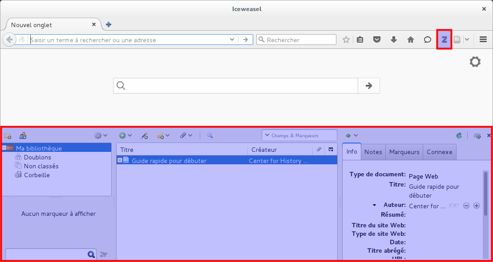
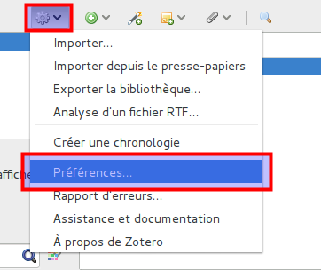
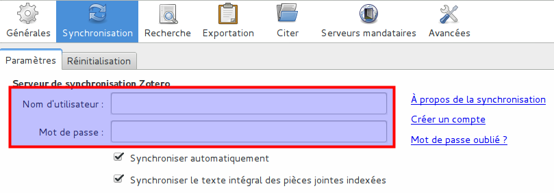

# Configuration de la synchronisation

Une fois Zotero installé, il faut encore faire le lien avec le compte que vous avez créé en ligne. Pour cela, il faut lancer Zotero. En haut à droite de votre navigateur se trouvent les boutons de l'extension. Le grand Z lance l'application, sous la forme d'une fenêtre au bas de votre navigateur.

L'interface est présentée en détail au point trois. Pour l'instant, cherchez où se trouvent les préférences de Zotero, dans le menu *Actions* (la roue dentée, sur la gauche). Dans ce menu, choisissez les *préférences...*

Celles-ci sont organisées par onglets. Le deuxième en partant de la gauche concerne la synchronisation. C'est à cet endroit qu'il faut indiquer son identifiant et son mot de passe. Les autres paramètres peuvent être laissés tel quel.

Une fois les champs remplis, vous pouvez fermer la fenêtre des préférences. Pour vérifier si la synchronisation fonctionne correctement, il suffit de cliquer sur la flèche circulaire verte sur la droite. Si aucun message d'erreur n'apparaît, c'est que tout fonctionne correctement.

Une fois que la synchronisation est configurée, lorsque vous ajoutez des références dans votre bibliothèque, elles sont automatiquement *uploadées* dans votre bibliothèque en ligne, sur le site de Zotero. Par défaut, votre bibliothèque est privée et elle ne peut être consultée qu'en se connectant au site avec votre identifiant.

Si vous reproduisez les étapes précédentes (installation et configuration de la synchronisation) sur un autre poste informatique, vous disposerez sur ces deux postes de votre bibliothèque de références bibliographiques et tout ce que vous ajoutez, commentez, modifiez, supprimez sur l'un des postes sera ajouté, commenté, modifié, supprimé à la fois en ligne et sur vos autres appareils.
