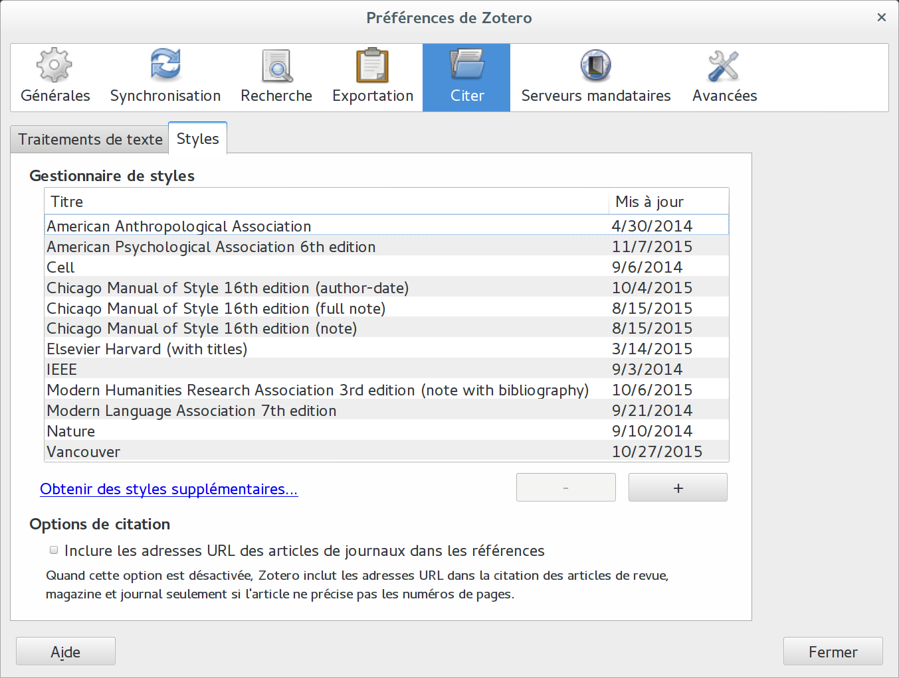
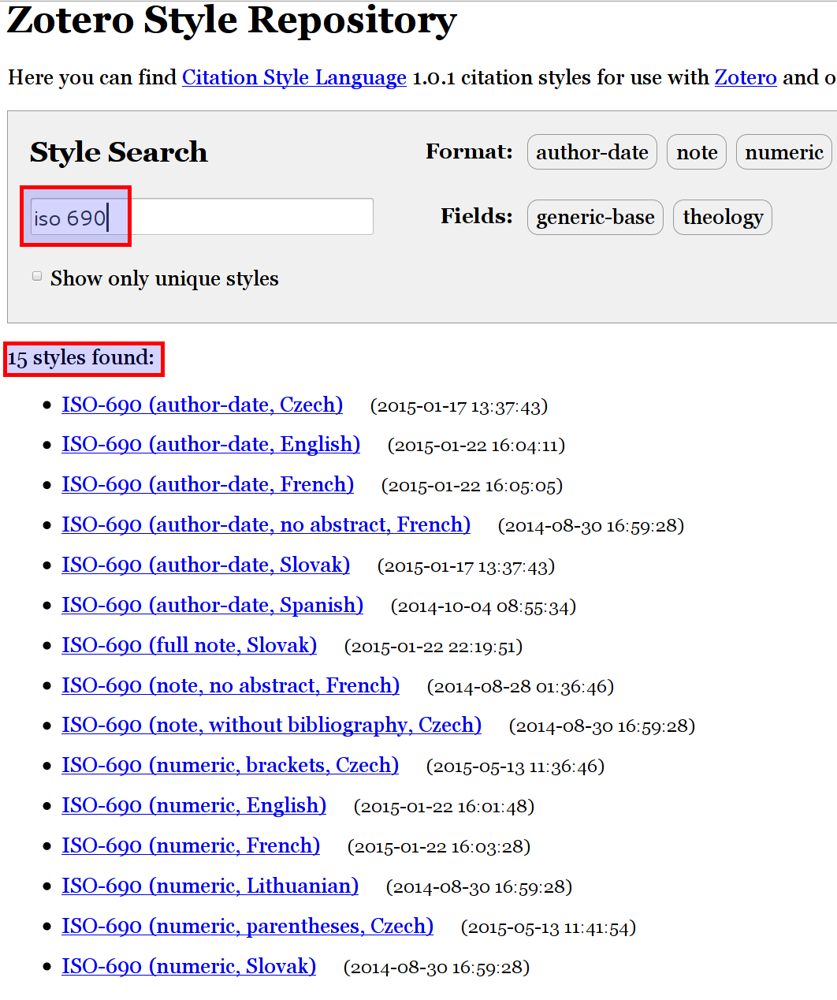

# Installer des styles

L'insertion de citations dans un travail et la rédaction de bibliographies se conforme en général à des manière très précises de travailler. Quasiment chaque discipline académique possède ses propres règles, qui peuvent de plus varier d'une institution à l'autre. Ce sont des conventions. Certaines d'entre elles ont acquis le status de norme, comme par exemple la méthode [*APA*](http://www.apastyle.org/). Par ailleurs, il existe une norme internationale, la norme [ISO 690](http://www.iso.org/iso/fr/iso_catalogue/catalogue_tc/catalogue_detail.htm?csnumber=43320).

Lorsque l'on utilise ces conventions de rédaction de référence bibliographique, il est important de garder à l'esprit leur but : permettre de communiquer de manière univoque les éléments permettant de retrouver un document, une source d'information ou une information. Quel que soit le style utilisé et les variations d'application, les éléments nécessaire à l'identification d'une source doivent être présents et facilement identifiable. Le plus important n'est pas de savoir si les zones (auteur, titre, date, etc.) doivent être séparés par des virgules ou des points, mais que la cohérence de la méthode au sein d'un même travail permette au lecteur de retrouver les sources utilisées.

Ainsi, il existe un grand nombre de styles bibliographiques. Les bons LGRB doivent permettre d'utiliser un grand nombre de styles. Le fait que Zotero est un projet libre et ouvert à toutes les collaborations, il propose plus de 8000 styles.

Par défaut, Zotero embarque les styles les plus utilisés. On les trouve dans le menu *Actions > Préférences... > onglet Citer > onglet Styles*.

Si cette liste ne propose pas le ou les styles désirés, il suffit de cliquer sur le lien au bas de la fenêtre de dialogue [*Obtenir des styles supplémentaires...*](https://www.zotero.org/styles), qui pointe vers le style de Zotero à l'URL suivante : https://wwww.zotero.org/styles

Cette page comprend un champ de recherche dans lequel il suffit d'entrer un partie du nom du style que l'on cherche. Il est également possible de trier au moyen des formats de citation (ou de la méthode : auteur, auteur-date, note en bas de page, numérique, etc.) et des catégories correspondant le plus souvent à des disciplines universitaires.

Pour installer les styles correspondant à la norme ISO 690, il suffit de chercher ces termes dans le champ de recherche. Plusieurs styles sont proposés, ce qui reflète notamment la richesse des styles réalisés par la communauté des utilisateurs de Zotero.

En passant son curseur sur le lien d'un de ces styles, une prévisualisation du résultat s'affiche. Sur la droit du lien se trouve la date de la dernière mise à jour du style.

Une fois le style choisi, il suffit de cliquer sur le lien. Une fenêtre s'affiche vous demandant si vous voulez installer ce style.
