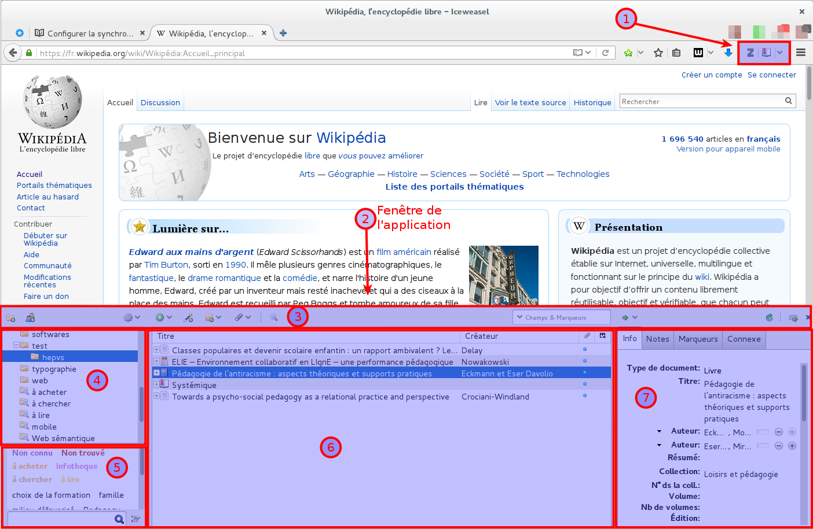

# L'interface de Zotero

L'interface de Zotero est composée des éléments suivants :

1. Les boutons de l'extension, à droite de la barre de recherche. Ils permettent de lancer Zotero et d'ajouter des références trouvées en ligne dans sa bibliothèque.
2. Tout en bas de la fenêtre du navigateur, l'application elle-même.

Celle-ci est elle-même divisée en cinq sections principales :

3. La zone de boutons des fonctionnalités.
4. La zone de la bibliothèque, des sous-collections et des bibliothqèues de groupe, à gauche.
5. La zone des marqueurs (étiquettes, tags).
6. La zone des références bibliographiques, au centre.
7. La zone de la description détaillée de chaque référence, à droite.

| Bouton | Fonctionnalité |
|:------:|:-------------- |
|| Permet d'ajouter une nouvelles sous-collection. Un clic droit donne également accès à cette fonction|
|| Ajoute un groupe |
|| Le menu *Actions*. S'y trouve les fonctionnalités d'importation et d'exportation, ainsi que les préférences|
