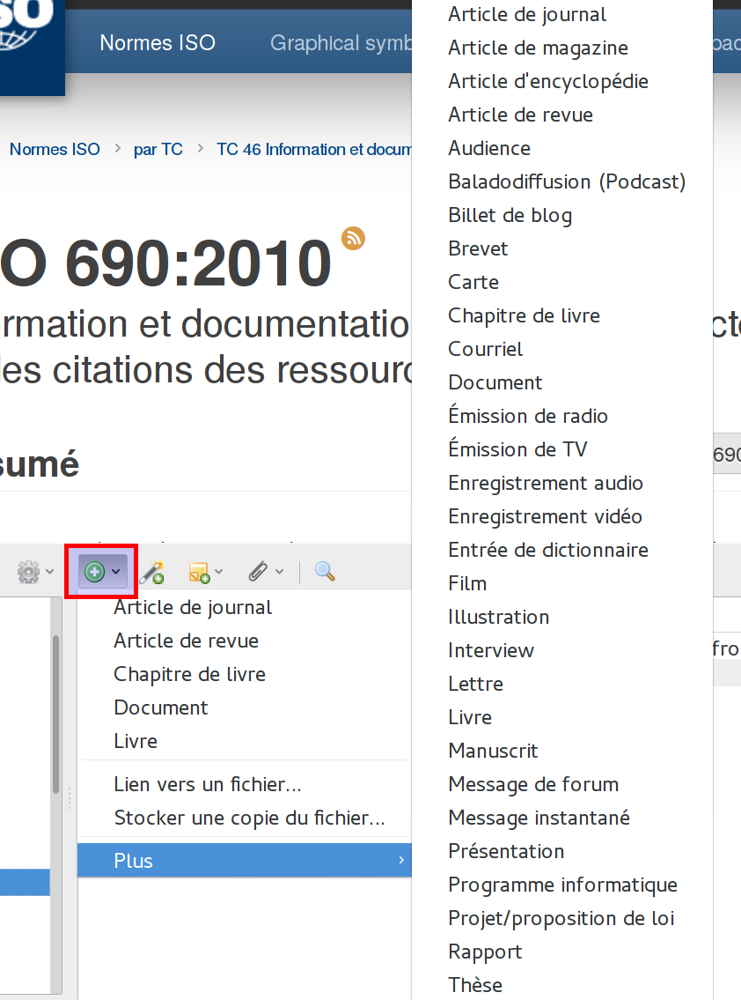
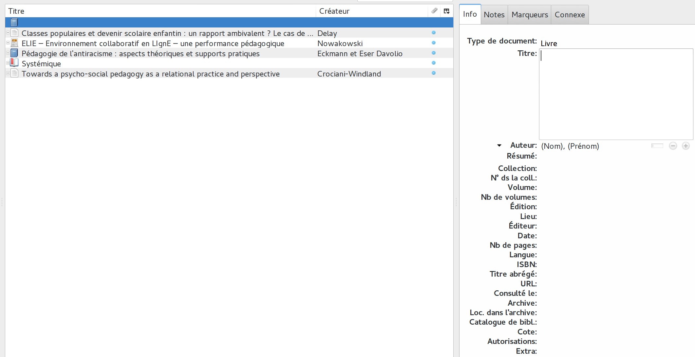
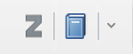
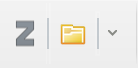

# Collecter des références

## Types de documents

| Icône | Type de document |
|:-----:|:-----------------|
|| Page web |
|| Livre |
|| Chapitre de livre |
|| Thèse de doctorat, mémoire |
|| Article de revue |
|| Rapport |
|| Papier de conférence |
|| Présentation |
|| Article de magazine |
|| Article de journal |
|| Billet de blog |
|| Article d'encyclopédie |
|| Loi, décret, jurisprudence, ... |
|| Podcast |
|| Film |
|| Vidéo |
|...| ... |

## Deux méthodes de récolte

Il existe deux méthodes pour ajouter des références bibliographiques dans Zotero :

1. Manuellement.
2. Automatiquement.

### Manuellement

La méthode manuelle n'est à utiliser que s'il n'est pas possible d'utiliser la méthode automatique : dans le cas, par exemple, ou l'on veut référencer un document qui n'a jamais été catalogué par une bibliothèque, qui ne se trouve sur aucune page Web. Cette situation est de plus en plus rare, mais elle reste possible.

Dans ce cas, il faut ouvrir Zotero et utiliser le menu pour ajouter une référence vide (icône du signe plus sur fond vert). Dans ce menu se trouve d'abord la liste des types de documents que l'on ajoute le plus souvent, puis une liste étendue sous l'entrée *Plus*.

Une fois le type de document sélectionné, on obtient une référence vide avec, sur la droite, un ensemble de champs vides à remplir le plus précisément possible.

Il est relativement rare de pouvoir remplir tout les champs. Mais il est important de le faire au moins pour les champs indispensables, qui changent selon les types de documents. On peut mentionner :

* Le ou les auteurs
* Le titre
* Le document hôte (site Web, revue, titre du blog, ...)
* Lieu et date d'édition
* Date de mise à jour (parfois très précisément)
* ISBN, ISSN, DOI, PMID, etc.
* L'URL qui permet d'accéder au document
* ...

### Automatiquement

Le plus souvent, il est possible d'accéder à une ressource via son navigateur Web, que ce soit :

* dans un catalogue en ligne, ou dans un outil de découverte proposé par une bibliothèque ;
* dans une banque de donnée, le plus souvent commerciale ;
* sur [*Google Scholar*](https://scholar.google.ch) ;
* sur le site d'une revue en ligne ;
* sur un blog ;
* sur un site Web ;
* sur un site de partage de vidéo en ligne ;
* etc.

Idéalement, le site Web qui propose la ressource qui vous intéresse a enregistré les données bibliographiques de telle manière que Zotero est en mesure de les importer automatiquement. Si c'est le cas, vous le saurez rapidement, parce que la zone des boutons de Zotero, à la droite de votre barre de recherche, affiche l'îcone du document que vous pouvez ajouter.

Pour ajouter une référence repérée par Zotero, il suffit de cliquer sur l'icône qui le signale. Une nouvelle référence est créée, avec les informations détectées automatiquement.

**Il est essentiel de vérifier la qualité des données importées !** Cette qualité détermine en effet la qualité des citations et des bibliographies généres par Zotero. Il sera bien plus pénible de corriger ces données à la fin de votre travail, alors que vous aurez certainement suffisamment de préoccupation, que de le faire immédiatement.
