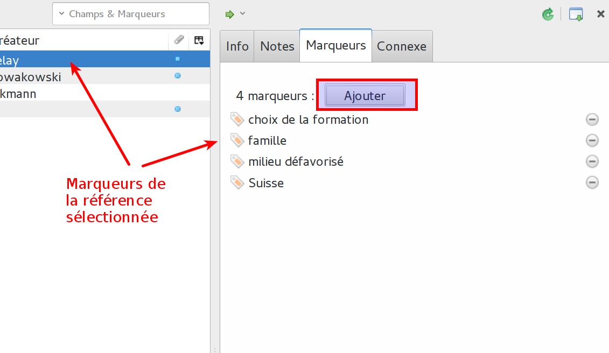

# Gérer ses références bibliographiques

## Bibliothèque et collections

À la création d'un compte Zotero, ou simplement après l'installation du logiciel, l'utilisateur dispose d'une *bibliothèque* (icône de la bibliothèque : ). Si vous ajoutez des références, à ce stade, elles se trouveront toutes dans ce même ensemble.

Il est bien entendu possible et conseillé d'organiser thématiquement ses références bibliographiques. Cette organisation se passe de manière très similaire à l'organistion des fichiers dans un ordinateur, avec des dossiers et des sous-dossiers. Dans Zotero, simplement, les dossiers sont des *collections* et des *sous-collections*.

Pour créer des collections et des sous-collections, il suffit de faire un clic-droit sur le dossier qui va la contenir, et choisir l'entrée de menu *Nouvelle sous-collection...* Pour renommer ou supprimer des collections, c'est également ainsi qu'il faut procéder.

## Les marqueurs

Les marqueurs permettent aussi d'organiser ses collections. On peut les voir comme des étiquettes ou des tags. Lorsque l'on importe des références depuis un catalogue de bibliothèque ou depuis une banque de données commerciale, Zotero crée le plus souvent des marques automatiquement. Pour cela, il s'appuie sur l'indexation matière de ces outils. Pour les autres sources de références, la plupart du temps ce n'est pas le cas.

Les marqueurs peuvent être utilisés pour trier vos références selon des thématiques. Et il est possible de créer à la volée des sous-ensembles consitués de l'union de deux marqueurs : avoir toutes les références qui possèdent le marqueur *pédagogie* et *systémique*, par exemple. Ce type de fonctionnement est particulièrement utile pour la création de collections dynamique (ci-dessous).

Pour visualiser et ajouter des marqueurs à une référence, il faut d'abord la sélectionner. Dans la colonne de droite s'affiche par défaut les informations de celle-ci. Cette colonne propose plusieurs onglets, dont l'onglet *Marqueurs*. Dans celui-ci se trouvent les marqueurs déjà attribués, si c'est le cas. Un bouton *Ajouter* permet d'ajouter manuellement des marqueurs. Les marqueurs ajoutés manuellement ont une étiquette jaune, alors que les marqueurs ajoutés manuellement ont une étiquette bleue.

Sur le bas de la colonne de gauche se trouve la zone des marqueurs. Là s'affichent tous les marqueurs de la collection sélectionnée. Un champ de recherche est à disposition pour trouver un marqueur précis dans la liste, qui peut devenir longue à force d'ajout de références. Dans la fenêtre, il est possible de cliquer sur un ou plusieurs marqueurs pour n'afficher que les références correspondantes.

## Les marqueurs de couleurs

## La recherche

### Recherche simple

### Recherche avancée et collections dynamiques

Il existe des collections *intelligentes*. Il s'agit en réalité de recherches enregistrées, qui se modifient dynamiquement au fur et à mesure des ajouts de références.
