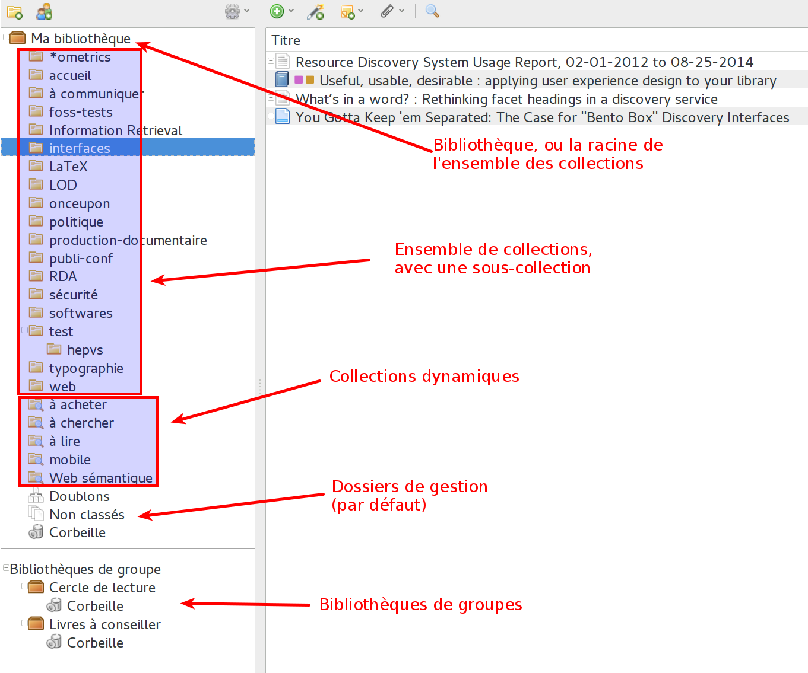
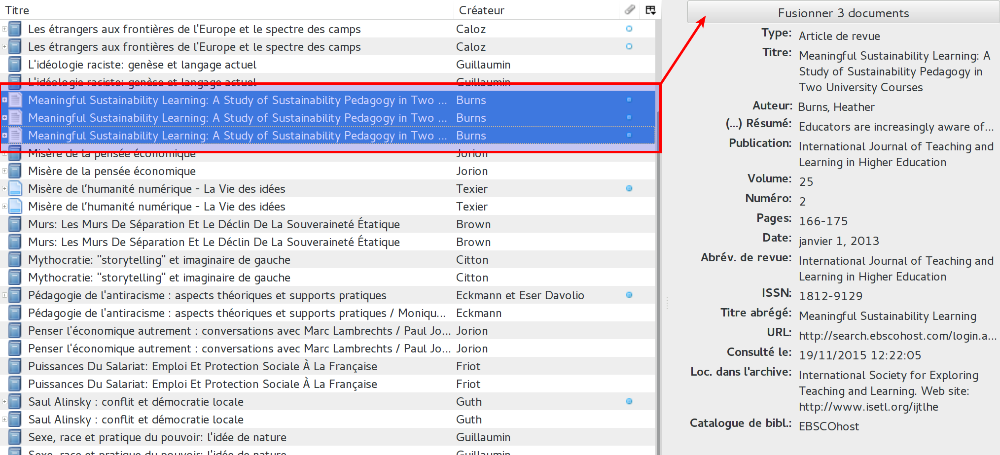
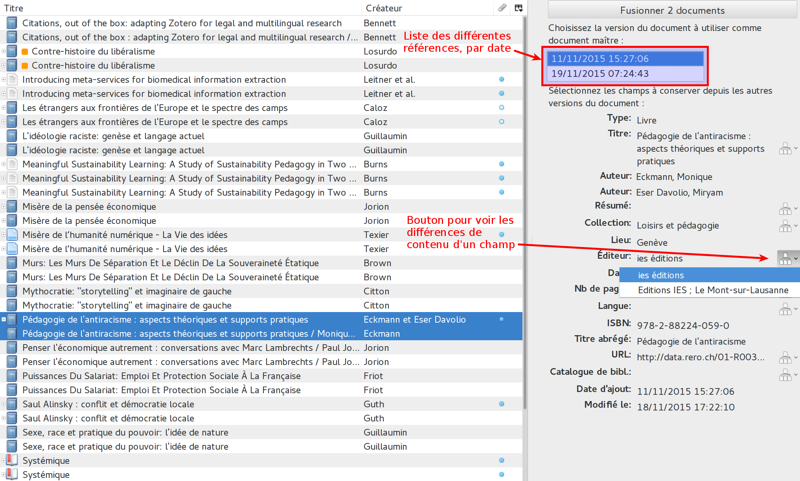

# Bibliothèque et collections

## Collections

À la création d'un compte Zotero, ou simplement après l'installation du logiciel, l'utilisateur dispose d'une *bibliothèque* (). Si vous ajoutez des références, à ce stade, elles se trouveront toutes dans ce même ensemble.

Il est bien entendu possible et conseillé d'organiser thématiquement ses références bibliographiques. Cette organisation se passe de manière très similaire à l'organisation des fichiers dans un ordinateur, avec des dossiers et des sous dossiers. Dans Zotero, simplement, les dossiers sont des *collections* et des *sous collections* ().

Pour créer des collections, vous pouvez utiliser le bouton  ou faire un clic droit sur le dossier qui va la contenir, et choisir l'entrée de menu *Nouvelle collection...* ou *Nouvelle sous collection...*. Pour renommer ou supprimer des collections, c'est également ainsi qu'il faut procéder. Les collections peuvent être déplacées au moyen d'un glisser-déposer.

Une fois vos collections et sous collections créées, vous pouvez ajouter les nouvelles références directement dans le bon dossier en sélectionnant celui-ci avant l'ajout. Il est bien entendu possible de glisser-déposer des références d'un dossier à l'autre. À noter que lorsqu'une collection ou une référence est déplacée, elle n'est pas dupliquée.

## Dossiers de gestion

Par défaut Zotero propose trois collections particulière, que l'on peut considérer comme des dossiers de gestion :

1. Les doublons .
2. Les éléments non classés .
3. La corbeille .

Les dossiers des doublons et des éléments non classés peuvent être cachés au moyen d'un clic droit. Pour les afficher à nouveau, il faut faire un clic droit sur la bibliothèque.

### Les doublons

Le dossier des doublons permet de repérer facilement les éléments qui ont étés ajoutés plusieurs fois. En sélection l'une des références concernées s'affiche sur la droite l'outil de dédoublonnage. Si les doublons comportent les mêmes champs et les mêmes données, l'outil propose simplement de les fusionner.

Par contre, si les champs et les données diffèrent, l'outil propose de choisir une référence maître. Il est également possible de voir, pour chaque champ, la différence de contenu, et de choisir le contenu à garder.

### Les éléments non classés

Ce dossier regroupe l'ensemble des références qui ne sont classées dans aucune collection. Ce n'est pas forcément un problème, puisque ces références sont peut-être classées au moyen des marqueurs (voir le point suivant, [*marqueurs*](02-marqueurs.html)) et des collections intelligentes. Pour autant, ce dossier, en facilitant l'identification des références non classées, aide à leur classement.

## Collections intelligentes

Les collections intelligentes () correspondent à des recherches enregistrées et elles se modifient dynamiquement. Ce point est expliqué de manière plus détaillée au point [*recherche*](03-recherche.html).
