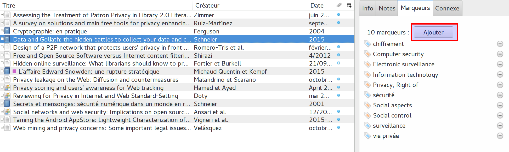
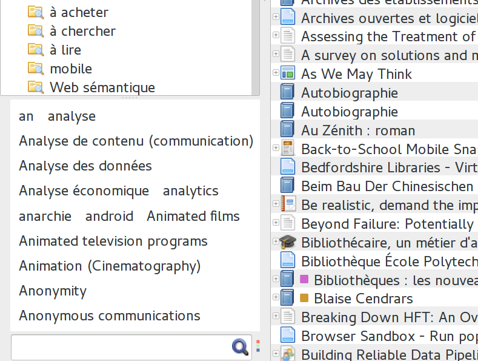
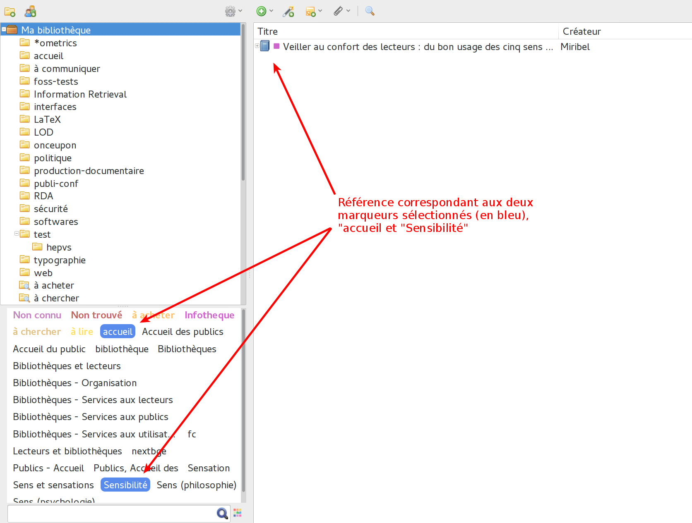

# Les marqueurs

Les marqueurs permettent aussi d'organiser ses collections. On peut les voir comme des étiquettes ou des tags. Lorsque l'on importe des références depuis un catalogue de bibliothèque ou depuis une banque de données commerciale, Zotero crée le plus souvent des marques automatiquement. Pour cela, il s'appuie sur l'indexation matière de ces outils. Pour les autres sources de références, la plupart du temps ce n'est pas le cas.

## Voir et ajouter des marqueurs

Pour visualiser et ajouter des marqueurs à une référence, il faut d'abord la sélectionner. Dans la colonne de droite s'affiche par défaut les informations de celle-ci. Cette colonne propose plusieurs onglets, dont l'onglet *Marqueurs*. Dans celui-ci se trouvent les marqueurs déjà attribués lorqu'ils existent.

Un bouton *Ajouter* permet d'ajouter manuellement des marqueurs. Les marqueurs ajoutés automatiquement ont une étiquette jaune (), alors que les marqueurs ajoutés manuellement ont une étiquette bleue ().

## Le sélecteur de marqueurs

Sur le bas de la colonne de gauche se trouve le sélecteur de marqueurs (). Là s'affichent tous les marqueurs de la collection sélectionnée. Un champ de recherche est à disposition pour trouver un marqueur précis dans la liste, qui peut devenir longue à force d'ajout de références. Dans la fenêtre, il est possible de cliquer sur un ou plusieurs marqueurs pour n'afficher que les références correspondantes.

Les marqueurs peuvent être utilisés pour trier les références selon des thématiques. Et il est possible de créer à la volée des sous-ensembles consitués de l'union de deux marqueurs : avoir toutes les références qui possèdent le marqueur *accueil* et *Sensibilité*, par exemple. Ce type de fonctionnement est particulièrement utile pour la création de collections dynamique (ci-dessous).

## Les marqueurs de couleurs

